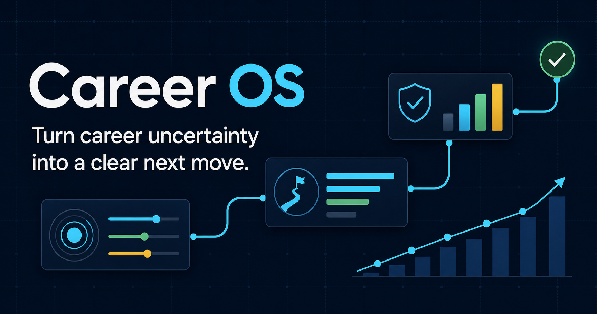

# Career OS



Career OS is a career-navigation platform that turns a person's priorities,
skills, work samples, and market signals into realistic career paths and a
practical action plan.

The current version is a polished product demo built with dummy data. It
includes candidate, employer, and university workspaces that demonstrate how
one connected career profile can support better decisions across the career
ecosystem.

## Why Career OS

Career advice is often generic, fragmented, or overly confident. Career OS is
designed to help people answer four practical questions:

1. Where am I now?
2. Which career paths are realistic from here?
3. What trade-offs matter for my priorities?
4. What should I do next to improve my opportunities?

Recommendations explain why they appear, show uncertainty, and connect each
career goal to concrete proof of skills and next actions.

## Core Impact Loop

Career OS is organized around four connected decisions:

1. **Priorities** - choose what matters now: income, stability, balance,
   learning, and people impact.
2. **Paths** - compare realistic routes by salary, effort, risk, upside, and
   time-to-role.
3. **Proof** - connect work samples to each path and identify the few gaps that
   materially limit opportunity.
4. **Action** - simulate the effect of a next step and turn it into a focused
   30-day plan.

The demo follows Aisyah, a data analyst exploring a move into backend
engineering. It turns a broad goal into three comparable paths, two priority
proof gaps, 27 potentially reachable roles, and one practical action plan.
All figures are dummy data and simulated outcomes.

## Product Experiences

- **Homepage** - communicates the career impact loop and provides direct entry
  into the dashboard and matched jobs.
- **Career Dashboard** - summarizes readiness, opportunity reach, priority
  actions, relevant roles, portfolio strength, and the next career decision.
- **Job Listings** - connects every role to a chosen path, current work samples,
  missing proof, salary range, and a reason for the match.
- **Company Directory** - supports search and filtering by sector, location,
  graduate friendliness, and relevant career path.
- **Compass** - compares career routes and simulates how specific actions may
  change readiness, salary range, and reachable roles.
- **Portfolio** - converts projects and outcomes into reusable career proof.
- **Employer Dashboard** - summarizes hiring pipeline health and explainable,
  work-sample-based candidate fit.
- **University Dashboard** - connects graduate outcomes, at-risk signals,
  curriculum gaps, and employer demand.

Supporting interactions include demo sign-in, account creation, workspace
switching, notifications, command search, saved items, responsive dark and
light themes, and reduced-motion support.

## Career Assessment Decision

Career OS does not use MBTI-style or animal personality tests. Those labels can
be memorable, but they may oversimplify people and imply that career preferences
are fixed.

Instead, the Compass workspace uses a career priorities check-in covering:

- Income growth
- Stability
- Work-life fit
- Learning pace
- People impact

These priorities are adjustable and directly influence path recommendations.

## Sustainability Mapping

Sustainability is integrated as an impact lens rather than a separate module:

- **SDG 4 - Quality Education:** lifelong learning and targeted skill
  development.
- **SDG 8 - Decent Work and Economic Growth:** clearer routes into better-fit,
  higher-quality work.
- **SDG 10 - Reduced Inequalities:** work-sample and capability signals that can
  reduce reliance on pedigree alone.

The mapping describes intended product outcomes. It does not claim that a role
or employer is sustainable without supporting data.

## AI and Data Scope

Haven demonstrates concept-only AI recommendations through deterministic,
contextual simulations. The project does not call an external AI API, consume
tokens, or train a custom model. Market, salary, candidate, employer, and
university data are all dummy data for this phase.

## Demo Data and Authentication

This repository currently uses dummy data and device-local browser storage.
The sign-in experience is functional for demonstration purposes, but it is not
a production authentication system.

Available demo workspaces:

- Candidate: Aisyah Rahman
- Employer: CIMB Talent Team
- University: Universiti Malaya

Saved roles, companies, plans, priorities, and portfolio entries remain on the
current device. Before using real personal data, connect a secure identity
provider, server-side authorization, and a persistent database.

## Technology

- Next.js 16 App Router
- React 19
- TypeScript
- Tailwind CSS 4
- Lucide icons
- next-themes
- Vercel Analytics
- pnpm

## Local Development

Install dependencies:

```bash
pnpm install
```

Start the development server:

```bash
pnpm dev
```

Open [http://localhost:3000](http://localhost:3000).

## Available Scripts

```bash
pnpm dev        # Start the local development server
pnpm typecheck  # Run TypeScript validation
pnpm build      # Create the production build
pnpm start      # Start the production server
```

## Deploying to Vercel

1. Push this project to a GitHub repository.
2. Import the repository into Vercel.
3. Keep the detected framework as Next.js.
4. Use `pnpm build` as the production build command if Vercel does not detect it automatically.
5. Deploy.

The application does not currently require environment variables. You may set
`NEXT_PUBLIC_SITE_URL` to the final production URL for explicit social metadata;
otherwise Vercel's production URL is detected automatically.

The current production build and TypeScript validation both pass.

## Project Structure

```text
app/                  Next.js pages, metadata, and global theme
components/auth/      Demo authentication and session models
components/career/    Shared charts, progress, and career UI
components/compass/   Career priorities, simulation, and path details
components/sections/  Candidate, employer, and university workspaces
components/shell/     Navigation, search, account, and application shell
components/ui/        Reusable interface components
lib/                  Shared state and utility hooks
public/               Public assets and social preview
```

## Product Principles

- Help users make decisions, not just browse information.
- Explain recommendations and uncertainty.
- Convert learning and work into understandable proof of skills.
- Prioritize actions that can improve opportunity and livelihood.
- Avoid pretending that career outcomes can be predicted with certainty.
- Keep users in control of their priorities and career direction.

## Suggested Production Phase

- Add production authentication and server-side authorization
- Store profiles, plans, and portfolio records in a real database
- Connect verified labor-market and salary data
- Add document and work-sample uploads
- Introduce explainable recommendation APIs
- Add privacy controls, consent flows, and account deletion
- Add automated testing and continuous integration

## Status

Career OS is currently a demonstration product with simulated market data. It
is suitable for product evaluation, presentations, hackathons, and continued
development, but not yet for storing real user career information.
